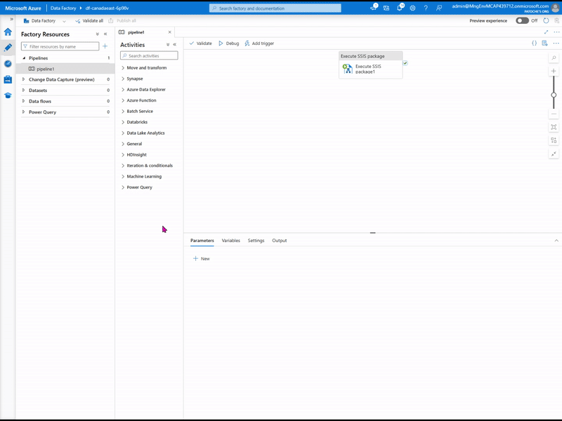
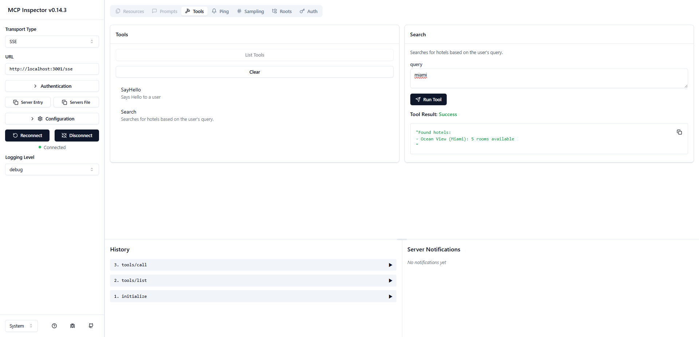
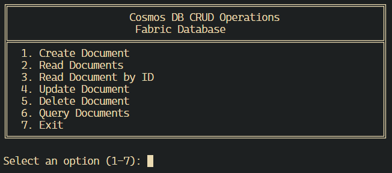

# Sample code
## Geo-replication in Azure Cosmos DB

This repository contains a project for setting up and demonstrating geo-replication with Azure Cosmos DB.

Source code available here: [https://github.com/patrice-truong/cosmosdb-geo-replication](https://github.com/patrice-truong/cosmosdb-geo-replication)

## Azure SSIS

This repository contains a project for executing an Azure Data Factory pipeline that moves data from an on-premises SQL Server to an Azure SQL database in the cloud.
The SSIS package used to move data to the cloud is stored in an SSISDB catalog.

Source code available here: [https://github.com/patrice-truong/Azure-SSIS](https://github.com/patrice-truong/Azure-SSIS)

## Azure Cosmos DB MCP Server and Client

This repository contains a project that shows how to create MCP client and server with Azure Cosmos DB

Source code available here: [https://github.com/patrice-truong/cosmosdb-mcp](https://github.com/patrice-truong/cosmosdb-mcp)

## MCP Client-Server Examples

This repository contains example implementations of Model Context Protocol (MCP) client and server applications in both C# and Node.js/TypeScript. The examples demonstrate how to build MCP-compatible servers that expose tools for hotel search functionality and clients that can connect to and interact with these servers.

Source code available here: [https://github.com/patrice-truong/mcp-client-server](https://github.com/patrice-truong/mcp-client-server)

## Cosmos DB CRUD Application for Microsoft Fabric

This is a C# console application that provides full CRUD (Create, Read, Update, Delete) operations for Azure Cosmos DB databases hosted in Microsoft Fabric.

Source code available here: [https://github.com/patrice-truong/csharp-cosmosdb-in-fabric-crud](https://github.com/patrice-truong/csharp-cosmosdb-in-fabric-crud)

